# [2040PRODUCTIONS](https://fenrirkin.github.io/2040Productions)

2040 Productions Portfolio
2040 Productions is the crafting and production company founded by my partner, Enka McEvoy. He currently has his many creative endeavours spread over various social media accounts, so for my first project, I decided to start a way to bring everything together. 

The target audience is anyone with an interest in artwork, specifically anime and comic-book style artwork, with a goal to encourage people to commission Enka directly. There is a market for unique, commissioned art pieces in this style, so putting a centralised website together to showcase the art and allow people to submit commission requests will remove some of the barriers for those who want their own art. 

---

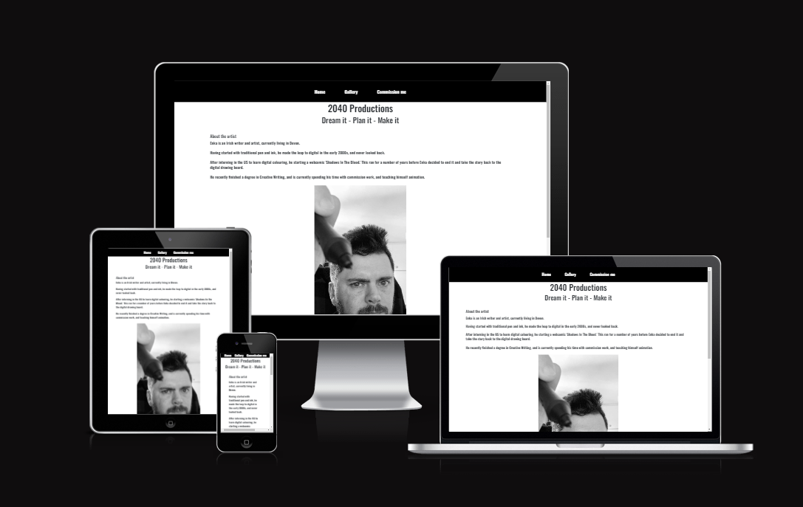

source: [amiresponsive](https://ui.dev/amiresponsive?url=https://fenrirkin.github.io/2040Productions)

## UX

To begin the design, I sketched out roughly how I wanted the website to look in one of my notebooks, with the goal of having at least 3 pages: [Home](documentation/indexrough.jpg), [Gallery](documentation/galleryrough.jpg), and [Commissions](documentation/pricerough.jpg). As an additional challenge to myself, I wanted to include a 404 page, and a form submitted page. 

The goal was to keep things clear and useable, with all the necessary information easily accessible.

### Colour Scheme

Enka has always kept his branding fairly monochrome, however I wanted to add just a little hint of colour that references the very first character Enka ever created, Reim. 

- `#FFFFFF` used for primary text.
- `#000000` used for primary highlights.
- `#000000` used for secondary text.
- `#8d4141` used for secondary highlights.

I used [coolors.co](https://coolors.co/contrast-checker/8d4141-ffffff) to check the [contrast](documentation/coloors.png) of my colour scheme and ensure it's as accessible as possible.

### Typography

For my fonts, I kept things simple in order to ensure cohesion across the site, by using [Oswald](https://fonts.google.com/specimen/Oswald) throughout. Despite being a fairly simplistic font, it offered a great deal of flexibility in terms of weighting, and the heavier weight improved the contrast and therefore the accessibility of the text.  

I also used [Font Awesome](https://fontawesome.com) icons for the social media icons in the footer, and made sure that the social media icons also stuck to the colour theme.

## User Stories

### New Site Users

- As a new site user, I would like to see pricing, so that I can work out if a commission is within my budget.
- As a new site user, I would like to browse artwork, so that I can see examples of the output.
- As a new site user, I would like to contact the artist, so that I can provide my commission details.

### Returning Site Users

- As a returning site user, I would like more detail in the form, so that I can be more in-depth in my initial communication.
- As a returning site user, I would like to see a constaly updating gallery, so that I know the user is active.

## Features

### Existing Features

- **Navigation Bar**

    - The Navigation bar is at the top of the site across all 3 main pages and the 2 extra pages. It was important to keep the visual of the Navigation bar consistent so that, no matter where on the site a user is, they will always be able to return to on of the 3 main pages. 

    I used black as the background and white as the main font color for contrast, and used a specific shade of red for the hover colour as a nod to the start of my partner's journey in art. 

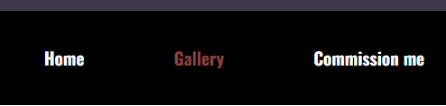

- **Gallery**

    - To keep the site as simple as possible, I opted to divide the gallery into 3 categories of art, and use a carousel in each category to display 2 or 3 images from each. The first two carousels were to showcase Enka's original creations, while the third carousel demonstrated his flexibility with previous commissions he's worked on for others. I opted for a carousel rather than a static gallery of multiple images as I felt it would be visually less overwhelming for site users. 

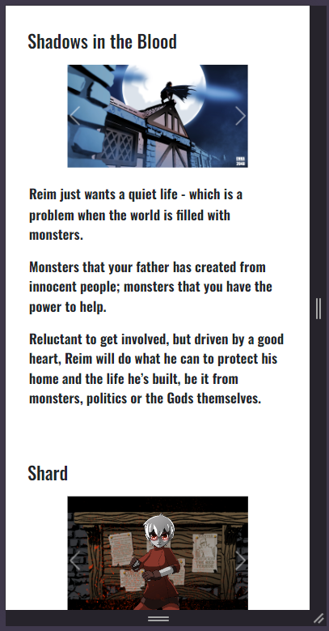

- **Commission form**

    - As artwork can be so variable, I decided that the contact form would work best if it was just contact details and a freeform text section. Currently it redirects just to a separate success page, with no information being retained, but in future I hope to direct all queries submitted through it to an email address. 

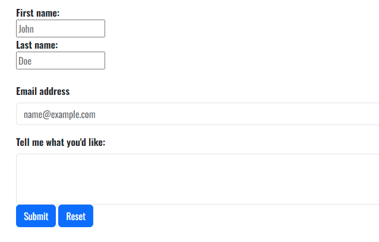

### Future Features

- TUTORIAL
    - I'd like to include a Tutorial page for basic drawing methods, using text, images, and embedded video.
- Submission Form
    - I'd like to expand the form functionality, to include drop-downs to select the level of commission to request. I'd also like to add a basket, to keep track of the costing of the commission

## Tools & Technologies Used

-  used to generate README and TESTING templates.
-  used for version control. (`git add`, `git commit`, `git push`)
-  used for secure online code storage.
-  used as a cloud-based IDE for development.
-  used for the main site content.
-  used for the main site design and layout.
-  used for hosting the deployed front-end site.
-  used as the front-end CSS framework for modern responsiveness and pre-built components.
-  used for the icons.
-  used to help debug, troubleshoot, and explain things.

## Testing

## Code Validation

### HTML

I have used the recommended [HTML W3C Validator](https://validator.w3.org) to validate all of my HTML files.

| Directory | File | Screenshot | Notes |
| --- | --- | --- | --- |
|  | 404.html | 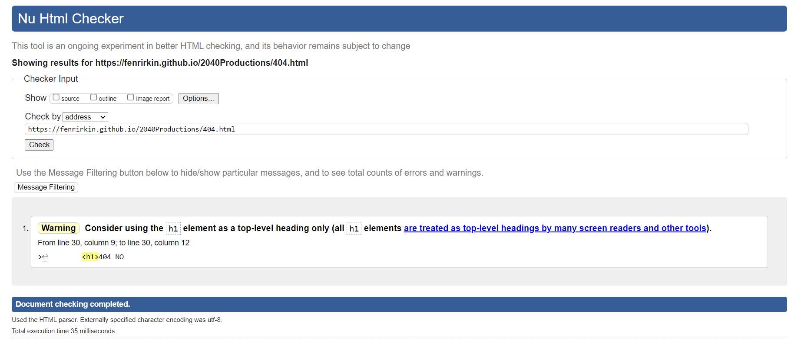 | |
|  | gallery.html | 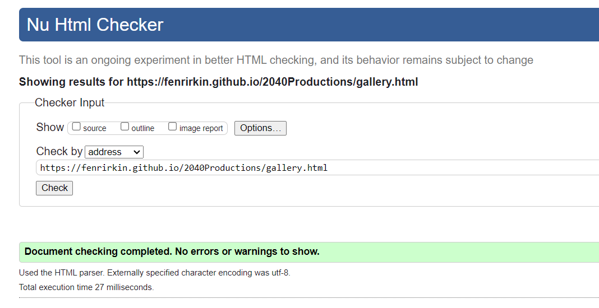 | |
|  | index.html | 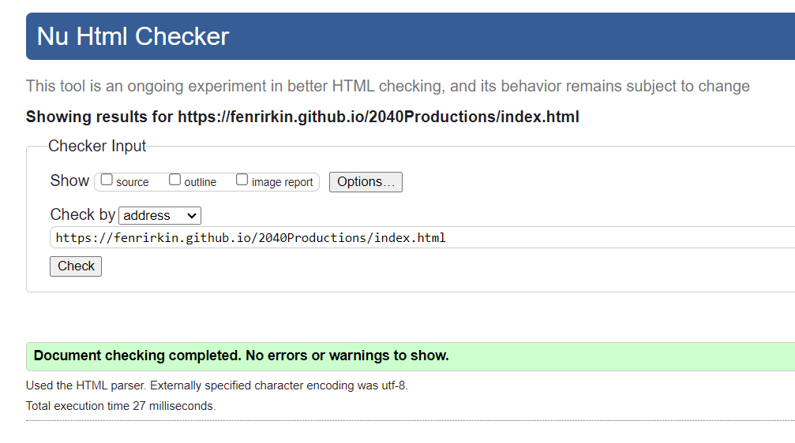 | |
|  | price.html | 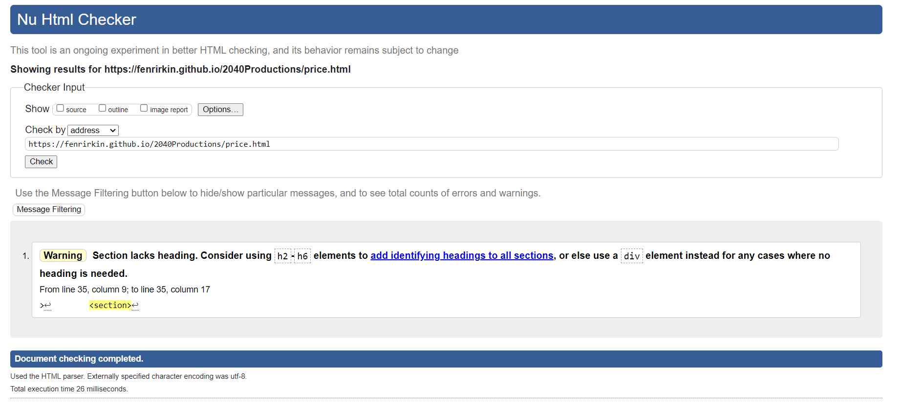 | |
|  | submissionsuccess.html | 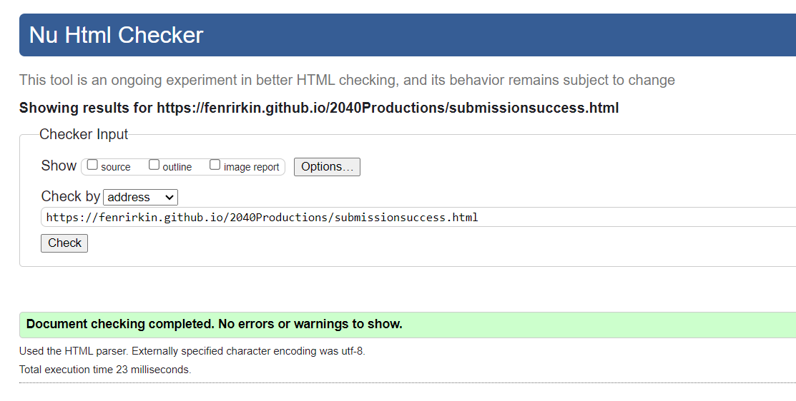 | |

### CSS

I have used the recommended [CSS Jigsaw Validator](https://jigsaw.w3.org/css-validator) to validate all of my CSS files.

| Directory | File | Screenshot | Notes |
| --- | --- | --- | --- |
| assets | style.css | 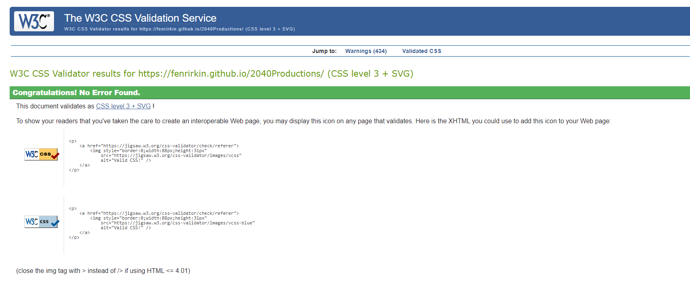 | |

## Browser Compatibility

I've tested my deployed project on multiple browsers to check for compatibility issues.

| Browser | Home | About | Contact | etc | Notes |
| --- | --- | --- | --- | --- | --- |
| Chrome | 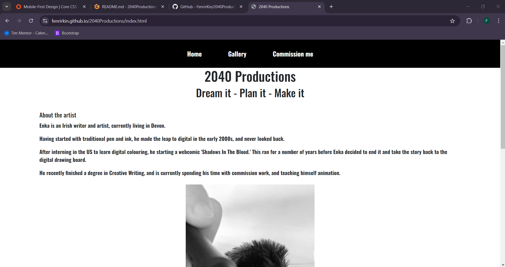 | Works as expected |
| Firefox | 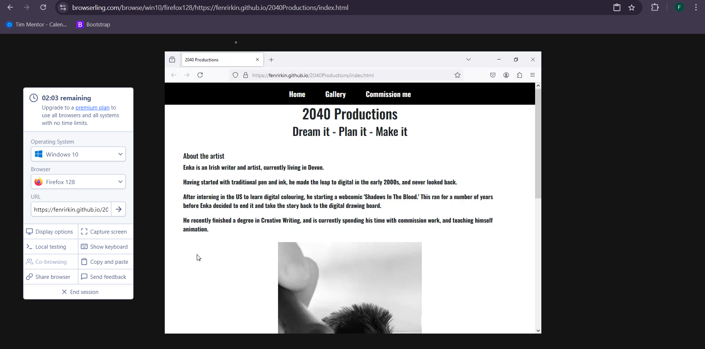 | Works as expected |
| Edge | 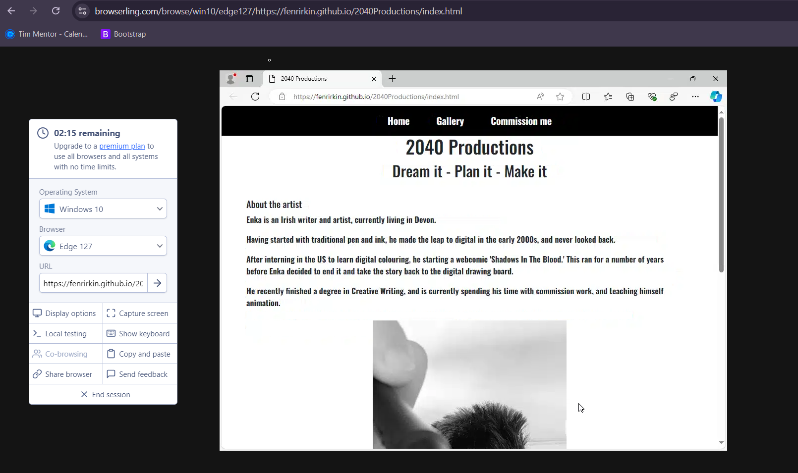 | Works as expected |

## Deployment

The site was deployed to GitHub Pages. The steps to deploy are as follows:

- In the [GitHub repository](https://github.com/FenrirKin/2040Productions), navigate to the Settings tab 
- From the source section drop-down menu, select the **Main** Branch, then click "Save".
- The page will be automatically refreshed with a detailed ribbon display to indicate the successful deployment.

The live link can be found [here](https://fenrirkin.github.io/2040Productions)

### Local Deployment

This project can be cloned or forked in order to make a local copy on your own system.

#### Cloning

You can clone the repository by following these steps:

1. Go to the [GitHub repository](https://github.com/FenrirKin/2040Productions) 
2. Locate the Code button above the list of files and click it 
3. Select if you prefer to clone using HTTPS, SSH, or GitHub CLI and click the copy button to copy the URL to your clipboard
4. Open Git Bash or Terminal
5. Change the current working directory to the one where you want the cloned directory
6. In your IDE Terminal, type the following command to clone my repository:
	- `git clone https://github.com/FenrirKin/2040Productions.git`
7. Press Enter to create your local clone.

Alternatively, if using Gitpod, you can click below to create your own workspace using this repository.

Please note that in order to directly open the project in Gitpod, you need to have the browser extension installed.
A tutorial on how to do that can be found [here](https://www.gitpod.io/docs/configure/user-settings/browser-extension).

#### Forking

By forking the GitHub Repository, we make a copy of the original repository on our GitHub account to view and/or make changes without affecting the original owner's repository.
You can fork this repository by using the following steps:

1. Log in to GitHub and locate the [GitHub Repository](https://github.com/FenrirKin/2040Productions)
2. At the top of the Repository (not top of page) just above the "Settings" Button on the menu, locate the "Fork" Button.
3. Once clicked, you should now have a copy of the original repository in your own GitHub account!

## Credits

Artwork: Enka McEvoy, 2040 Productions

### Content

| Source | Location | Notes |
| --- | --- | --- |
| [Markdown Builder](https://tim.2bn.dev/markdown-builder) | README and TESTING | tool to help generate the Markdown files |
| [Chris Beams](https://chris.beams.io/posts/git-commit) | version control | "How to Write a Git Commit Message" |
| [W3Schools](https://www.w3schools.com/howto/howto_js_topnav_responsive.asp) | entire site | responsive HTML/CSS/JS navbar |
| [W3Schools](https://www.w3schools.com/css/css_positioning.asp) | entire site | image positioning |
| [StackOverflow](https://stackoverflow.com/questions/12991351/how-to-force-image-resize-and-keep-aspect-ratio) | entire site | Image resizing and forced aspect ratio |

### Media

All media used on the site was created by and sourced from Enka McEvoy, but with his full knowledge and permission to do so. All rights to the media remains with Enka McEvoy.

### Acknowledgements

- I would like to thank both of my Code Institute mentors, [Tim Nelson](https://github.com/TravelTimN) and later his husband, Chris, for their support throughout the development of this project.
- I would like to thank the [Code Institute](https://codeinstitute.net) tutor team for their assistance with troubleshooting and debugging some project issues.
- I would like to thank the [Code Institute Slack community](https://code-institute-room.slack.com) for the moral support; it kept me going during periods of self doubt and imposter syndrome.
- I would like to thank my friend, Adam, whose delight at having a friend who understands his code woes shone through in his willingness to help me rubber duck my bugs.
- I would like to thank my partner (Enka), for believing in me, and being endlessly supportive and encouraging while I used his creations for this project.